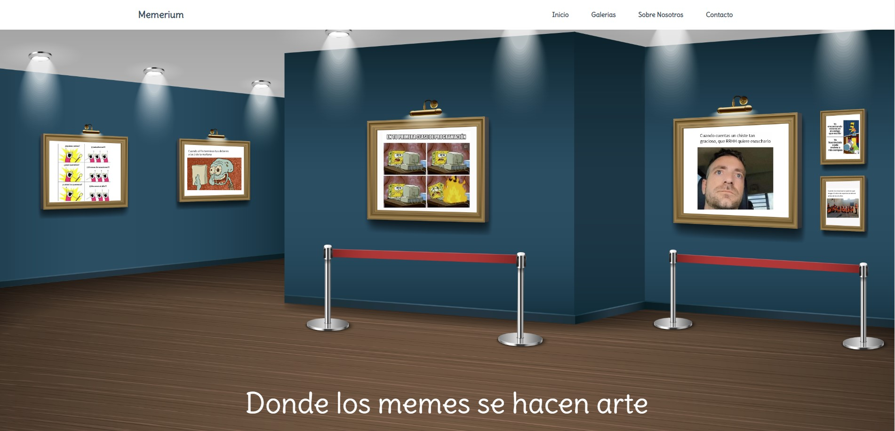

# Memerium 🎨✨

¡Bienvenido a **Memerium**, un museo web dedicada a los memes! 🎭 Este proyecto ha sido desarrollado para la **Red Nacional de Museos** con el objetivo de facilitar a los usuarios la creación, edición, eliminación y visualización de memes de forma sencilla y divertida.



## 🌟 Funcionalidades Principales

- **Añadir memes**: Sube tus memes favoritos y guárdalos en la plataforma.
- **Editar memes**: Modifica tus creaciones cuando lo desees.
- **Eliminar memes**: Deshazte de aquellos memes que ya no te gusten.
- **Visualizar memes**: Navega y explora tu colección personal de memes.

---

## 🚀 Tecnologías Utilizadas

Este proyecto ha sido construido con las siguientes herramientas y tecnologías:

- **React**: Biblioteca de JavaScript para construir interfaces de usuario interactivas.
- **React Router v6.4+**: Para una navegación fluida y gestión del enrutado con `createBrowserRouter`.
- **React-hook-form**: Simplifica la gestión de formularios con el hook `useForm`.
- **Axios**: Para realizar solicitudes HTTP asíncronas al servidor.
- **json-server**: Proporciona una API simulada rápida y fácil para las operaciones CRUD.
- **Vitest**: Marco de pruebas ligero para asegurar la funcionalidad del proyecto.

---

## 📋 Requisitos Previos

Antes de comenzar, asegúrate de tener instalados los siguientes componentes:

- **Node.js** y **npm** (Node Package Manager)
- **json-server** para simular una API RESTful

---
## 🛠️ Instalación de Node.js y json-server

Si aún no tienes **Node.js** ni **json-server** instalados en tu máquina, sigue estos pasos:

### 1. Instalar Node.js y npm

Ve al sitio web oficial de Node.js: [Descargar Node.js](https://nodejs.org)  
Descarga e instala la versión LTS (Long Term Support), que incluye npm, el gestor de paquetes.

- **Windows/Mac**: Sigue el asistente de instalación.
- **Linux**:
    ```bash
    sudo apt update
    sudo apt install nodejs
    sudo apt install npm
    ```

Para verificar la instalación:

```bash
node -v
npm -v
```
Esto debería mostrar las versiones instaladas de Node.js y npm.
2. Instalar json-server globalmente
Una vez tengas Node.js instalado, procede a instalar json-server globalmente ejecutando el siguiente comando en tu terminal:
```
npm install -g json-server
```
Para verificar que json-server se instaló correctamente, usa el siguiente comando:
```
json-server -v
```

## 🛠️ Instalación y Configuración

Sigue estos sencillos pasos para instalar y configurar el proyecto en tu entorno local:

1. **Clona el repositorio**:
    ```bash
    git clone https://github.com/tu-usuario/memerium.git
    cd memerium
    ```

2. **Instala las dependencias**:
    ```bash
    npm install
    ```

3. **Instala json-server** (si no lo tienes instalado globalmente):
    ```bash
    npm install -g json-server
    ```

4. **Inicia el servidor de json-server**:
    ```bash
    npm run api
    ```
    Esto levantará un servidor RESTful en `http://localhost:3001` con la base de datos simulada en `db.json`.

---

## 🌐 Uso de la Aplicación

1. Abre tu navegador en `http://localhost:3000` para ver **Memerium** en acción.
2. ¡Explora las funcionalidades de la app! Añade, edita y elimina memes de tu colección.

---

## 💡 Recomendaciones

- **Minimalismo**: Opta por una interfaz limpia y fácil de usar.
- **Aprovecha Hooks**: Usa `React-hook-form` para los formularios y `React Router` para la navegación.
- **Axios**: Simplifica las peticiones al servidor con esta poderosa librería.
- **Tests**: No olvides realizar pruebas con `Vitest` para garantizar el buen funcionamiento de la app.

---

## 🤝 Contribuciones

¡Las contribuciones son más que bienvenidas! Si tienes una idea para mejorar **Memerium**, abre un issue o un pull request para discutir los cambios. Juntos podemos hacer esta aplicación aún mejor.

---

## 📄 Licencia

Este proyecto está bajo la **Licencia MIT**. Siéntete libre de consultar el archivo `LICENSE` para más detalles.

---

Gracias por ser parte de **Memerium**. ¡Esperamos que disfrutes creando y gestionando tus memes favoritos! 🎉

